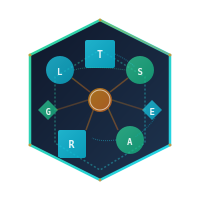

<p align="center">
  
</p>

<p align="center">
  <a href="https://hex.pm/packages/lineage_ir">
    
  </a>
  <a href="https://hexdocs.pm/lineage_ir">
    
  </a>
<a href="LICENSE">
    
  </a>
</p>

# LineageIR

Lineage IR for cross-system traces, spans, artifacts, and provenance edges. Provides a shared
Event envelope and Sink interface for consolidation across runtimes without forcing shared storage.

## What it covers

- Trace, Span, Artifact, ArtifactRef, ProvenanceEdge, and LineageGraph structs
- LineageIR.Event envelope with validation and normalization
- Sink behavior with adapter contracts and idempotency helpers
- Default Ecto adapter that accepts a Repo module via config
- JSON encoding/decoding with stable field naming
- ID/time conventions: Ecto.UUID + utc_datetime_usec

## Installation

Add `lineage_ir` to your dependencies:

```elixir
def deps do
  [
    {:lineage_ir, "~> 0.1.0"}
  ]
end
```

## Quick start

```elixir
alias LineageIR.{Event, Span, Sink}

span = %Span{
  id: Ecto.UUID.generate(),
  trace_id: Ecto.UUID.generate(),
  name: "llm.call",
  started_at: DateTime.utc_now()
}

event = %Event{
  id: Ecto.UUID.generate(),
  type: "span_start",
  trace_id: span.trace_id,
  span_id: span.id,
  occurred_at: DateTime.utc_now(),
  source: "flowstone",
  source_ref: "run_123",
  payload: span
}

:ok = Sink.emit(event, adapter: LineageIR.Sink.Adapters.Ecto, repo: MyApp.Repo)
```

## Guides

- Lineage IR overview: `guides/lineage_ir_overview.md`
- Event envelope: `guides/event_envelope.md`
- Sink usage: `guides/sink_usage.md`
- Artifact and edge modeling: `guides/artifact_edge_modeling.md`

## Conventions

- All IDs are Ecto UUIDs stored as strings.
- All timestamps are UTC with microsecond precision.
- Trace/work/plan/step identifiers are propagated through events and payloads.

## License

MIT. See `LICENSE`.
